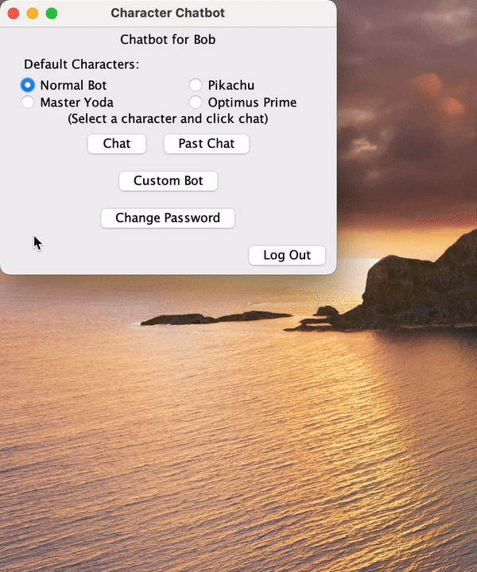
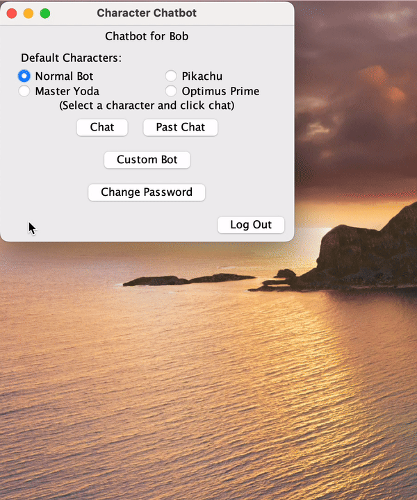
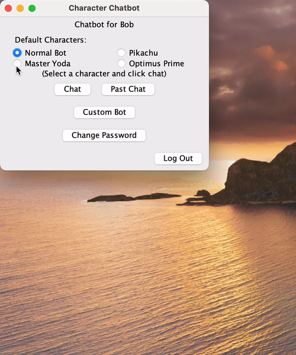
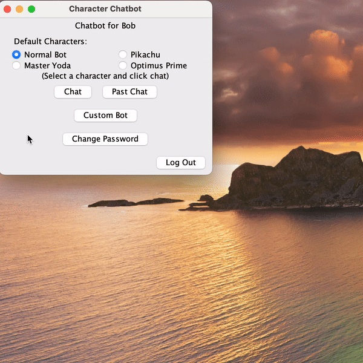
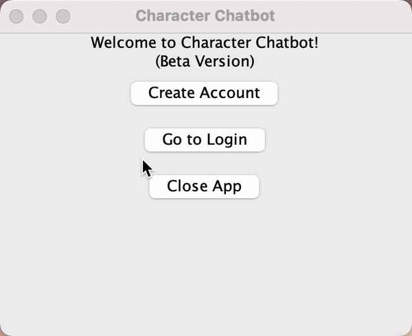
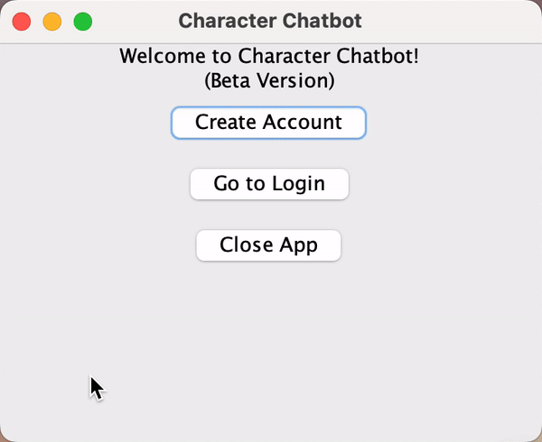

# Character Chatbot
\*\*\*This is simply a fork of the project from my school account. My individual contributions to the app are under the ThomasSwanick github account.***

This project implements a fully functional character based chatbot application using the GPT-4o API. The project is
implemented using Uncle Bob's Clean Architecture software design philosophy. As much as possible, we also tried to adhere to the SOLID design principles.
Our main focus was the structure and organization of the code, not the GUI (clearly lol, yucky Java Swing) or the optimization of the bot responses. Note that
the API key has been deactivated so to have a working version of the app after following the installation instructions, you would need to purchase your own key
and set it as an environment variable.

Here is a link to a youtube video I recorded to demo the main features of the application: [Character Chatbot Demo](https://youtu.be/ORRLnTfXpTQ)

Here are the presentation slides I created: [Presentation Slides](https://github.com/swanickt/CharacterChatbot/blob/6158c725ce53509e307b846149b8dadfd0cbed90/images/CharacterChatbotPresentation.pdf) (Some of the gifs/animations won't be playable but many of them are included below in the README)

## ***README Table of Contents***
1. [Project Contributors](#Project-Contributors)
2. [Project Summary](#Project-Summary)
3. [Software Features](#Software-Features)
4. [Installation Instructions](#Installation-Instructions)
5. [Initial Usage Guide](#Initial-Usage-Guide)
6. [License](#License)
7. [Leaving Feedback](#Leaving-Feedback)
8. [Contributing to Character Chatbot](#Contributing-to-Character-Chatbot)

## ***Project Contributors***
- Thomas Swanick (github account: ThomasSwanick)
- Yi Pan (github account: YiPan1028)
- Yukun Wang (github account: NKwyk)
- John Deng (github account: JonDD-D)

## ***Project Summary***

Like any other AI chatbot, the Character Chatbot program allows users to converse with an AI model which responds to user inputs in a human like manner.
Aside from the standard AI bot available, the user also has the option to assign a character to the AI.
Specifically, they can choose from default characters Pikachu, Master Yoda, or Optimus Prime.
The chatbot will then respond using the mannerisms and tones of the chosen character.

Character Chatbot also allows the user to create their own custom characters.
This includes the ability to assign the AI to a pre-existing celebrity/character or create a completely new persona from scratch!
The program also keeps track of a user’s past chat so that they may revisit their previous conversation, no matter how long it's been since the conversation.

**Why this project?**

This project was made as a means to enrich the average person's
chatbot experience! We live in a world where most people use tools like
ChatGPT on a consistent or even daily basis. With this level of use,
why spend your time talking to a boring robotic AI when you can get all the same functionality
from your favourite character or celebrity!

## ***Software Features***

### Chatting Features
Currently, the character chatbot application supports chats with 4 default characters. A standard
AI bot, Pikachu the Pokemon, Optimus Prime the autobot, and Master Yoda the Star Wars jedi. Aside from these
easily accessible default personas, the user has the option to create any character they wish to chat with from scratch.

### Demo Chat with the Normal AI:


### Demo Chat with Pikachu:


### Demo Chat with Optimus Prime:


### Demo Chat with Master Yoda:


### Creating a custom bot:
This small demo shows how a Character Chatbot user can create their own custom characters. This includes
the ability to chat with real or fictional pre-existing characters not currently offered as a default,
or creating completely new personas from scratch. This specific example shows the process for
creating a bot to chat with Scooby-Doo!



### Viewing your Past Chat:
No matter how long it's been since you've logged in to your Character Chatbot account,
you have the ability to view your previous conversation in full!


## ***Installation Instructions***

### 1) Prerequisites
Ensure your system meets the following requirements:

- **Operating System:** The program should run on any modern OS, but we recommend Windows 10 or later,
  macOS 10.15 or later, or a Linux distribution with kernel 5.x or later.
- **Java Development Kit (JDK):** Version 11 or higher. For instance, [Adoptium OpenJDK](https://adoptium.net)
- **Maven:** Version 3.6.3 or higher. Download link: [Apache Maven](https://maven.apache.org/download.cgi)
- **Git:** Latest stable version. Download link: [Git SCM](https://git-scm.com/downloads)

### 2) Cloning the Repository
Navigate to the directory where you want to clone the project and open the terminal or command prompt. Clone the repo:
```
git clone https://github.com/ThomasSwanick/CharacterChatbot.git
```
This will create a directory named `CharacterChatbot` in your current location.

You can navigate to the project directory, with command:
```
cd CharacterChatbot
```

### 3) Building the Project

**Compile and Package:**

Use Maven to build the project:
```
mvn clean package
```
This command will generate a JAR file in the `target` directory. Make sure the build completes without error.

### 4) Running the Application

To execute the JAR file and run the application, use the following command:
```
java -jar target/CharacterChatbot-1.0-SNAPSHOT.jar
```

**NOTE:** Replace CharacterChatbot-1.0-SNAPSHOT.jar with the actual JAR file name if it differs.

### Common Issues and Solutions:
As a desktop GUI-based application, there are two common issues with installation.
- **Maven Build Failures:**
    - *Issue:* Missing dependencies or incorrect Maven configuration.
    - *Solution:* Ensure your `pom.xml is` correctly configured and all dependencies are available. Run `mvn clean install` to resolve dependencies.


- **Java Version Compatibility:**
    - *Issue:* Incompatible Java version.
    - *Solution:* Verify that your Java version matches the project's requirements. Use `java -version` to check your current version.

### Additional Resources:
- **Project Documentation:** Refer to the [README.md](https://github.com/ThomasSwanick/CharacterChatbot/blob/main/README.md) for more details.
- **Issue Tracker:** Report issues or request features via the [GitHub Issues](https://github.com/ThomasSwanick/CharacterChatbot/issues) page.


## **Initial Usage Guide**
Once you have followed the installation instructions and are ready to get started
using Character Chatbot, you can follow these two tutorials. The first shows you how
you can create your account. Once you have an account, the second tutorial details
how you can log in, log out, and change your password if needed.

### Creating a Character Chatbot Account:



### Logging In, Changing your Password, and Logging Out:



## ***License***

This project is licensed under the **CC0 1.0 Universal (Public Domain Dedication) license**.

By applying this license, we have waived all copyright and related rights in the project to the fullest extent allowed by law, effectively placing it in the public domain. This means you are free to:

- Use the work for any purpose, including commercial use.
- Modify and adapt the work.
- Redistribute and share the work without restrictions.

**Important Notes:**
The work is provided "as-is," without warranties of any kind.
No trademark or patent rights are granted with this license.
It is your responsibility to ensure you have all necessary permissions to use this work in your specific context.

## ***Leaving Feedback***
We value your feedback to help improve our project! Here's how you can share your thoughts:

### How to leave feedback:
- All feedback should be submitted through the GitHub Issues section of this repository.
- Navigate to the Issues Page and click New Issue.
- Choose the appropriate issue template for your feedback (e.g., "Bug Report" or "Feature Request").
- Fill out the form with the required details and submit it.

### Rules for leaving feedback:
1) Be Specific:
   Clearly describe the issue or suggestion.
   Include steps to reproduce bugs, if applicable.
2) Provide Evidence:
   Attach screenshots, code snippets, or logs to support your feedback.
   Explain how the issue impacts your experience with the project.
3) Stay Respectful and use constructive language.
   Avoid personal criticisms or offensive remarks.
4) Focus on the Scope of the Project:
   Ensure your feedback is relevant to the project’s goals and purpose.

### What to expect when leaving feedback:

- As with pull request, expect to receive a response within 10 business day of opening your issue.
- We will review your feedback, and update the issue status to "In Progress" or "Resolved".
- If we need additional details, we will request clarification.
- For bug reports, we will provide updates once they are fixed.
- For feature reports, we will decide on the feasibility of such an implementation and get back to you
  with a decision.

## ***Contributing to Character Chatbot***
### Making Contributions:

If you would like to contribute to Character Chatbot, we would gladly
take a look at your ideas. To submit a potential contribution, or idea, follow these steps:

1) Before deciding to make a contribution, check the existing issues to make sure your idea
   is not already being addressed.
2) If not, create a new issue describing your idea and a detailed explanation of your idea
   or the bug you would like to fix.
3) You can then fork the repo by clicking the Fork button in the top-right corner of the page.
   Clone this forked repo to your local machine. Usually your IDE will provide some sort
   of "get from VCS" feature to allow you to do so.
4) In order to avoid conflicts, create a new branch and implement your changes within it.
5) Once your implementation is complete, commit and push your changes to your remote repository.
6) You can then submit a pull request by going to the original repository (the one where you got your fork)
   and clicking New Pull Request.

### Pull Request Guidelines:

In order to maintain consistency and ease the review process, we ask that your pull request follow
specific guidelines.
1) Be specific! Clearly explain what the pull request does, and outline any and all changes to the program's functionality.
2) Make sure to reference the related issue in your request (e.g. closes issue #87)
3) As much as possible, try to follow clean architecture, the SOLID design principles and the style
   of the pre-existing code.
4) Include tests for any and all additions, making sure they pass before submitting the pull request.
5) Add comments when necessary and make sure to adhere to all checkstyle guidelines as outlined in the
   mystyle.xml file.
6) Update the relevant documentation (including the README) if your changes affect any functionality.

*Pull requests that do not meet these standards may be ignored or closed without review.*

### Our Review Process:

- You can generally expect reviews within 10 business of your pull request.
- Pull requests will be reviewed for functionality, performance, code quality and whether your tests pass and
  are exhaustive.
- Once approved, contributions will be merged into the main branch by one of the original 4
  contributors and if revisions are requested, address them in full and update the PR.
- Contributors will be acknowledged in the [Project Contributors](#Project-Contributors) section.
