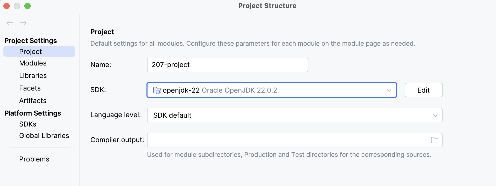
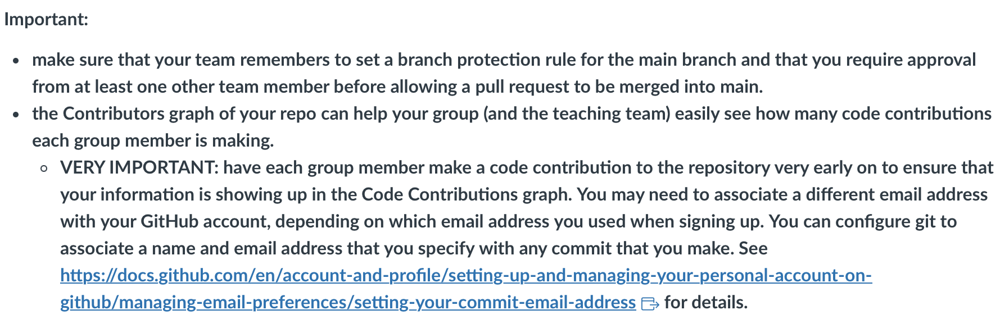
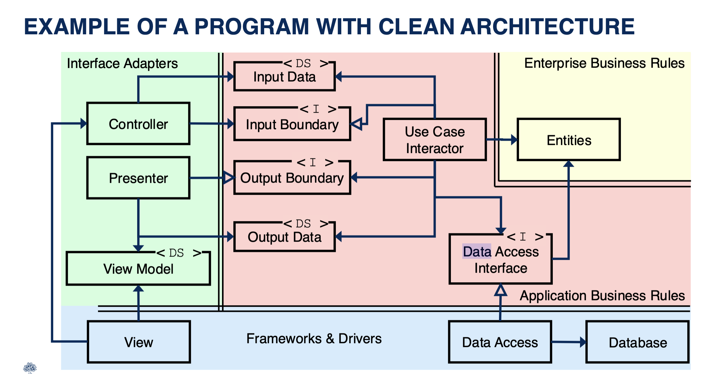

S## Team Members:

**Note for TA** We are mainly using discord to communicate what features we are currently working on
instead of solely using github issues. We may periodically create issues but prefer this method as it
forces us to communicate consistently. 

- Thomas Swanick (github account: ThomasSwanick)
- Yi Pan (github account: YiPan1028)
- Yukun Wang (github account: NKwyk)
- John Deng (github account: JonDD-D)

## User Stories:

**Note for TA** These vary from our original blueprint submission on Markus. We have decided to not seperate
the account types into free/premium and instead focus on making the design/clean architecture
as best as possible (i.e. instead of over implementing features). However, we have decided
to replace the work of making multiple account types with a custom character
feature.

**[Team Story]** Bob is bored and home all by himself.He wants to chat with 
someone but all his friends are currently busy or unavailable. He decides to run the 
Character Chatbot app and spends the next half hour **conversing with the normal AI bot.**

**[Yukun Wang]** Bob wants to know what it would be like to talk to his favourite robot Optimus Prime. To find out,
he **talks to the Optimus Prime character** in Character Chatbot.

**[Yukun Wang]** Bob wants to include a happy birthday message written by Pikachu in his son's
birthday card. Bob **uses the Pikachu character offered by Character Chatbot** to produce this message.

**[Yi Pan]** Bob is a huge Star Wars fan. He has always wanted to **talk to master Yoda** about the philosophy of life. Bob can achieve his dream through his Character Chatbot account.

**[John Deng]** Bob previously had a conversation with a bot in Character Chatbot. Some time has passed and he wants to revisit the conversation so that he can remember the main points. 
Bob logs in to his account and goes to his **chat history to view that conversation in full**.

**[Thomas Swanick]** Bob wants to be able to **create an account, log in, and change his password** if he forgets it,
so that he can still access his Character Chatbot account.

**[Thomas Swanick and Yi Pan]** Bob wants to be able to **create his own character** with a unique name and attributes
so that he can chat with it on Character Chatbot.

# Some Stuff for us to keep in mind:
## Java Version
Make sure to use openjdk-22. I think this is the newest version and what we've already been using this semester:

## Making pushes/pull-requests
- First thing to do:

- You can find that link on Quercus. Make sure your school email is associated (it should already be that way)
and make a small pull request from a new branch to make sure you show up in the graph. You can just slightly edit this
README or add a comment somewhere or something.
- Settings are such that each pull request just requires one reviewer. 
- Everytime you're working on a new feature/usecase, you should create a new branch for it. It would be easier if right when we create
our branches, we make a push to github (git push origin <branch_name>) so the others know what we're working on.
- Also before pushing your final copy of the branch to github and opening a pull request,
make sure to pull the most recent version of the main branch (into your local main branch) and merge
that into your feature branch. Then you can deal with the conflicts (if there are any) before
trying the pull request.
## Style 

- While you're coding and following the structure of the starter code
(it's just the code we already did for lab 5, slightly modified), keep this picture in
mind:
  

- Try to follow SOLID and clean architecture (can refactor at the end). If you follow the stuff
from the starter code, that should be like 95% good.
- Try to write JDocs (can be stupidly basic) and tests for your stuff as you go.
- Try to keep stuff as private as possible (always make instance variables private
with getters/setters if needed.)
- Make helper methods private.
- I'm not sure if they care about checkstyle but if so, we can just use the
configurations from the mystyle.xml file.

## John/database stuff 
There are three DAOs in package `data_access`! All three implement the Data Access Interface
from the use cases. The Use Case code works with any of them.

* Class `FileUserDataAccessObject` manages data storage and retrieval in a
  CSV file, and also keeps the data in a `Map` for easier access. This temporary storage
  is called a *cache* of the information in the file.

* Class `DBUserDataAccessObject` uses okhttp to use an API, working with JSON data. Your team
  might want to refer to this when you do your API work. This API is similar to the one from the third lab;
  you can read its documentation
  [here](https://www.postman.com/cloudy-astronaut-813156/csc207-grade-apis-demo/documentation/fg3zkjm/5-password-protected-user).

- For the database stuff, John will have to use one of the above two options (or something else that's easy to integrate but these 2 have examples
in labs 3,4 and 5 and are already designed to fit with the structure of the starter code (the lab 5 solo part might be especially useful, but keep in mind
that the stuff for task 2 (editing login use case) is already implemented). You could also look at what's done for "minimal note application" 
on Quercus, under "project repository and sample starter code") 
- Until then, we can hook up our code to
  `InMemoryDataAccessObject` to make sure stuff works and start programming (also use this one for all tests).

* Class `InMemoryDataAccessObject` **doesn't save the user data to any kind of file at all**,
  and is intended to be used by the unit tests.
    * It's also simple to write, which means that you can start
      programming your Use Cases before you even have the details of data persistence worked out.
- At the end, we should delete anything in the `data_access`! package we don't use.